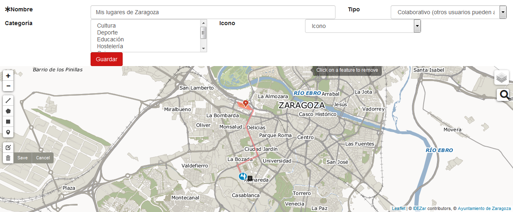

# Manual de uso
Las principales funciones del módulo son:
* Consulta de mapas existentes
* Generación de nuevos mapas
* Colaborar en mapas existentes añadiendo información a los mismos

A continuación se explicarán las diferentes opciones disponibles. Primero se explicará la página de inicio del módulo para, a partir de ella, ir explicando las diferentes funcionalidades. 

# Página de inicio
La página de inicio del módulo tiene la siguiente apariencia:

 
Está formada por:
* Una descripción del servicio
* Un listado de opciones sobre el listado de mapas que se muestra en la parte inferior:
** Crear mapa: para crear un nuevo mapa
** Mis mapas: para mostrar los mapas de los usuarios autenticados en el portal
** Mapas en los que puedo colaborar: filtra el listado de mapas mostrando solo los que permiten colaboraciones
** Todos los mapas: muestra el listado completo de mapas, eliminando cualquier filtro que se haya aplicado
* Un cuadro de búsqueda
* Listado de categorías por las que se pueden filtrar los mapas, en la figura de arriba “Jóvenes Visitantes”
* Por último, el listado de mapas representados como fichas, mostrando tres en cada fila del listado. Este listado muestra elementos de 50 en 50

# Crear un mapa (I)
Para crear un mapa, hay que seleccionar la opción “Crear Mapa” en la página de inicio. Una vez seleccionada dicha opción, se mostrará la página de creación que tiene la siguiente apariencia:

Esta pantalla de edición está formada por los campos:
* Nombre (obligatorio): nombre del mapa
* Tipo: tipo del mapa. El tipo del mapa puede ser:
** Publicado: mapa público pero que no permite la edición por parte de otros usuarios
** Colaborativos: mapa público que permite la modificación por parte de otros usuarios
** Privado: mapa privado, sólo el usuario que lo ha creado podrá ver el mapa
* Categoría: categoría a la que pertenece el mapa
* Icono: icono con el que se quiere representar el mapa en el listado de la página de inicio
* Mapa: mapa sobre el que se añadirán los elementos. En la parte izquierda del mapa, justo debajo de los botones de zoom (+ / -), están las herramientas para añadir puntos, líneas, poli líneas y rectángulos al mapa, editar las capas del mapa y eliminar elementos. 

Una vez introducidos el nombre del mapa y seleccionados el tipo, categoría e icono, deben añadirse los elementos al mapa. A continuación se muestra como añadir los diferentes elementos al mapa.

## Añadir un punto
Si se selecciona este icono , se puede añadir un punto al mapa, simplemente pinchando en la localización donde se desea añadir. Cuando se añade el punto al mapa, se abre un cuadro de diálogo para añadir la información del mismo:
* Nombre
* Descripción
* Tipo de icono
Este cuadro de diálogo se muestra en la siguiente imagen.

El tipo de icono permite representarlo de diferentes maneras. En la imagen anterior, el punto se representa como un icono. Pero si selecciona atención ciudadana, el icono se muestra como en la siguiente figura:

 
## Anadir una poli línea
Si se selecciona el siguiente icono , se puede añadir una poli línea al mapa. Para añadir una línea, se deben ir marcando en el mapa los diferentes puntos que forman la poli línea. Para terminar de introducir puntos, se debe pulsar sobre el último punto introducido. En la siguiente imagen se muestra como se introduce una poli línea.

 
Una vez introducida la línea, si se pulsa sobre ella, se abre un cuadro de diálogo para añadir la siguiente información:
* Nombre
* Descripción
* Color de la línea
* Ancho de la línea
* Opacidad de la línea

Este cuadro de diálogo se muestra en la siguiente imagen.

## Anadir un polígono
Si se selecciona el siguiente icono , se puede añadir un polígono al mapa. Para añadir un polígono, se deben ir marcando en el mapa los diferentes puntos que forman el polígono. Para terminar de introducir puntos, se debe pulsar sobre el punto que cierra el mapa. En la siguiente imagen se muestra como se introduce un polígono.

 
Una vez introducido el polígono, si se pulsa sobre él, se abre un cuadro de diálogo para añadir la siguiente información:
* Nombre
* Descripción
* Color del borde
* Ancho del borde
* Opacidad del borde
* Color del relleno
* Opacidad del relleno

Este cuadro de diálogo se muestra en la siguiente imagen.

## Anadir un rectángulo
Si se selecciona el siguiente icono , se puede añadir un rectángulo al mapa. Para añadir un rectángulo, se deben ir marcando en el mapa los diferentes puntos que forman el rectángulo. Para terminar de introducir puntos, se debe pulsar sobre el punto que cierra el mapa. En la siguiente imagen se muestra como se introduce un rectángulo.

Una vez introducido el rectángulo, si se pulsa sobre él, se abre un cuadro de diálogo para añadir la siguiente información:
* Nombre
* Descripción
* Color del borde
* Ancho del borde
* Opacidad del borde
* Color del relleno
* Opacidad del relleno
Este cuadro de diálogo se muestra en la siguiente imagen.

## Modificar elementos del mapa
Para modificar los elementos del mapa, hay que seleccionar el icono  que permite seleccionar los diferentes puntos del mapa y realizar modificaciones con el mismo funcionamiento que se ha explicado para añadir elementos.

## Eliminar elementos del mapa
Para modificar los elementos del mapa, hay que seleccionar el icono  que permite seleccionar los diferentes puntos del mapa y después seleccionar el icono . Una vez hechos estos pasos, se pincha sobre los elementos a eliminar. Una vez eliminados los elementos deseados, se debe pinchar sobre el icono IMAGEN para deshabilitar la eliminación de elementos.

# Crear un mapa (II)
Una vez añadidos los diferentes elementos, la pantalla de edición tendría la siguiente apariencia:

En este caso se han añadido dos puntos, una poli línea, un polígono y un rectángulo. Si se guarda el mapa, se guarda el mapa y se pasa a la pantalla de listado de mapas del usuario edición de mapa directamente que tiene el siguiente aspecto.

En esta pantalla se pueden modificar tanto los datos generales del mapa como los elementos que forman parte del mapa. También se puede duplicar el mapa, para crear una copia del mismo así como eliminarlo.

# Mis mapas
Si en la pantalla principal se selecciona la opción “Mis Mapas”, se pasa a una pantalla donde se listan todos los mapas desarrollados por el usuario autenticado. En esta pantalla se pueden gestionar todos los mapas del usuario. Se puede ver la estructura de esta pantalla en la siguiente imagen.

Si se selecciona un mapa, se pasa a la página de detalle del mapa donde se puede ver el mapa con sus elementos, así como las opciones para compartir dicho mapa. A continuación se muestra la página de detalle de un mapa.

Debajo del mapa, existen diferentes opciones para compartir el mapa. Estas opciones son:
* HTML embebido: se proporciona el código
* XML: se proporciona la información del mapa como XML
* JSON: se proporciona la información del mapa como JSON

Existe otro botón, “Más información” que lleva a una página donde proporciona información general sobre el servicio de mapas colaborativos disponible en el portal. A continuación se muestra la pantalla de detalle del servicio.

# Editar un mapa
Si en el listado de mapas de la pantalla principal, se selecciona uno de ellos, se pasa a una pantalla donde se puede visualizar toda la información del mapa tal y como se puede ver en la siguiente imagen.

Si el mapa permite la colaboración y se quiere editar, se debe seleccionar la opción “Colaborar”, pasando a una página de edición que será similar a la que se muestra a continuación.

# Eliminar un mapa
Para eliminar un mapa, hay que seleccionar la opción “Mis Mapas” y en el listado de mapas propios, seleccionar el mapa que se quiere eliminar. Una vez seleccionado, habría que seleccionar la opción “Eliminar” que aparece a la derecha de la página de edición tal y como se muestra en la siguiente imagen.

# Filtrar por categorías
Debajo del cuadro de búsqueda, se pueden mostrar categorías que engloban diferentes mapas. Si se pulsa sobre una de ellas, el listado de mapas sólo mostrará aquellos mapas que pertenecen a dicha categoría. En la siguiente imagen se puede ver el listado de mapas que pertenece a la categoría “Jóvenes visitantes”.

# Compartir mapas en Redes Sociales
Los mapas que se muestran en el listado de mapas de la página principal, tienen un icono que permite compartir dicho mapa en diferentes Redes Sociales. Si pincha en la flecha junto al icono de compartir, se despliega una lista de Redes Sociales donde se puede compartir dicho mapa como se puede ver en la siguiente imagen.

Las opciones para compartir son las siguientes:
* Twitter
* Facebook
* Whatsapp
* Google Plus
* LinkedIn
* Pinterest
* Correo electrónico

Si, por ejemplo, se decide compartir por Twitter, se abriría una pantalla con el siguiente aspecto.

En ella se indica el nombre y la URL del mapa, permitiendo añadir texto al usuario que comparte la información.
